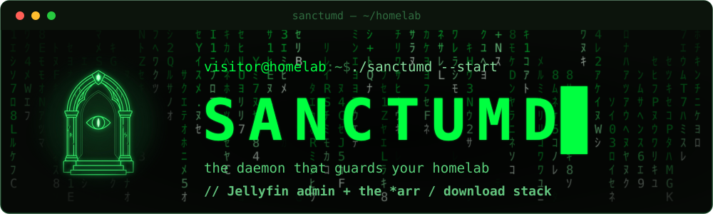
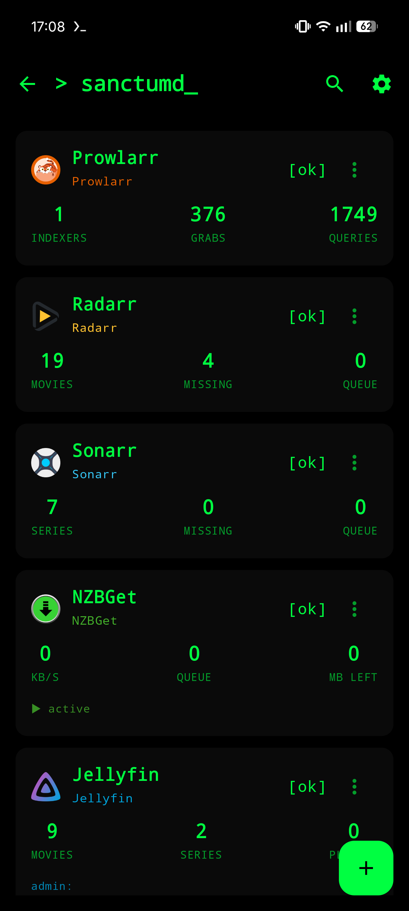
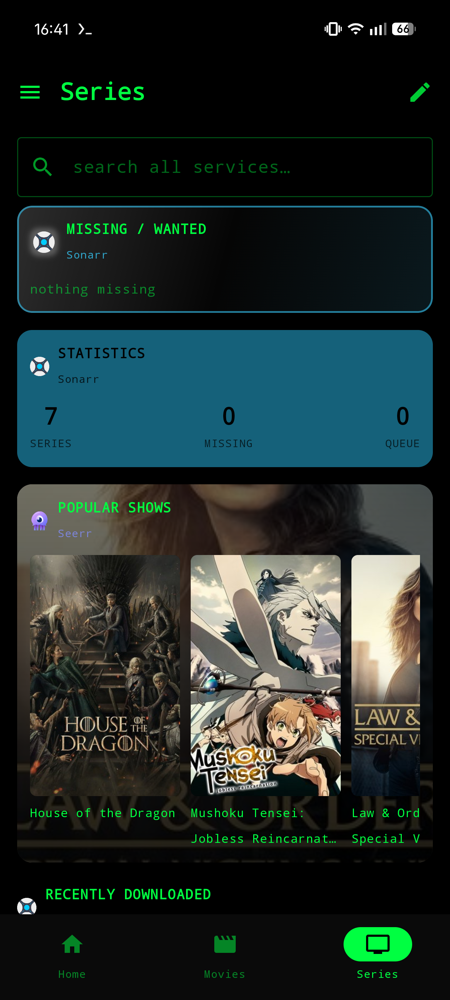
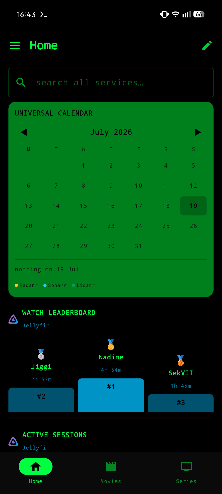
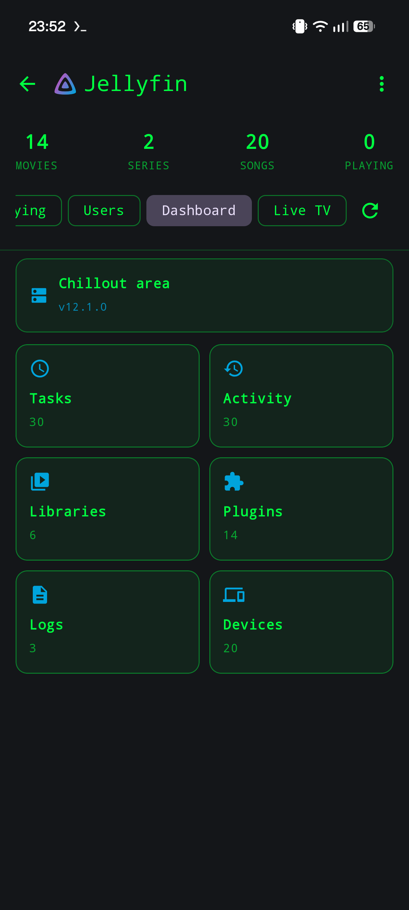
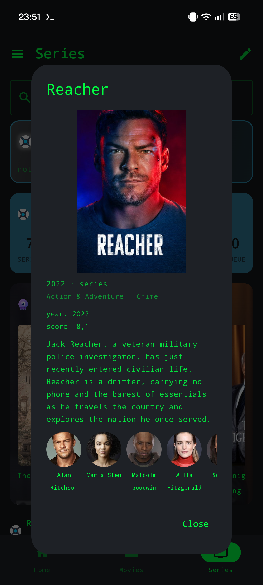
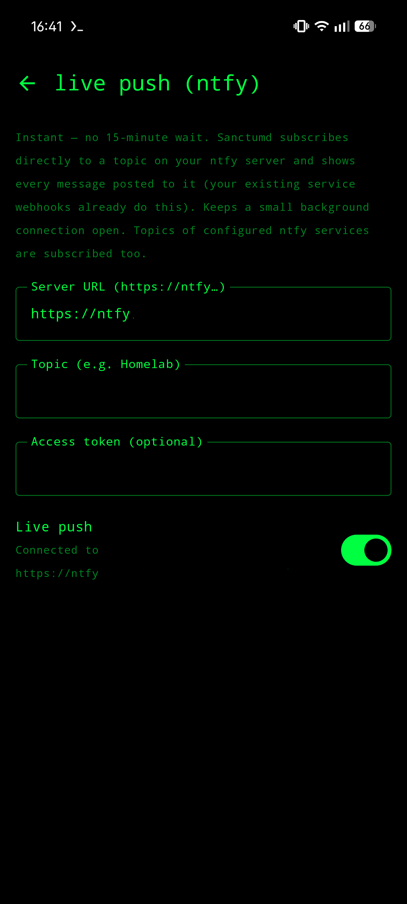

<div align="center">



<br>


**Jellyfin admin + the \*arr / download stack. One native Android app, one matrix-terminal theme.**

</div>

```console
visitor@homelab:~$ ./sanctumd --whoami

  > one Compose app for your whole
    self-hosted stack. add services
    once: status, queues, media,
    requests, users, logs, all in
    one terminal-styled UI. every
    action hits each service's own
    API directly. no backend. no
    account. the daemon that guards
    your homelab.
```

<div align="center">
  
  
  <br>
  
  
  <br>
  
  
</div>

<div align="center">

**works with**

&nbsp;&nbsp;&nbsp;
&nbsp;&nbsp;&nbsp;
&nbsp;&nbsp;&nbsp;
&nbsp;&nbsp;&nbsp;
&nbsp;&nbsp;&nbsp;
&nbsp;&nbsp;&nbsp;
&nbsp;&nbsp;&nbsp;


<sub>Jellyfin · Radarr · Sonarr · Lidarr · Prowlarr · Seerr · NZBGet · ntfy<br>
<sub>and any HTTP endpoint, as a shortcut</sub></sub>

</div>

---

## ▚▚ `./features`

<details open>
<summary><b>media &amp; requests</b></summary>

```text
[jellyfin]
  dashboard · tasks · activity
  users · per-library access
  media browse · cast · now playing
  plugins · libraries · logs

[radarr / sonarr / lidarr]
  library · missing · cutoff
  queue · history · add
  interactive search → grab
  manual import · per-ep monitoring
  cast · where-to-stream (via Seerr)
  system & health

[seerr]
  requests · issues · discover
  watchlist · per-season requests
  approve/decline · media detail
  where-to-stream, per region
  users & stats

[prowlarr]
  indexers · search · history
  tasks · send-to-arr

[nzbget]
  queue · history · pause/resume
  edit · add-url · server details
```
</details>

<details>
<summary><b>the dashboard</b></summary>

```text
[home]
  editable tabs + services drawer
[cards]
  queues · missing · coming-soon
  recently-added · poster rows
  statistics · watch leaderboard
  sections · quick-buttons
[style]
  accent · header icon · poster size
  fan-art Ken-Burns background
  flat / solid / glass themes
[search]
  global, across all services
[widgets]
  Glance home-screen: shortcuts ·
  status · quick actions · agenda
```
</details>

<details>
<summary><b>notifications</b></summary>

```text
[ntfy]
  add it like any other service
  browse a topic's messages
  (the server keeps ~12 h)
  several topics per server
[live-push]
  direct ntfy topic subscription
  → instant local notifications
  reuses your webhook topic
  per-server merge · catch-up
  masked topic in the title
  tap one → the title it is
  about, in the app it lives in
[fallback]
  on-device polling worker for
  new media / imports / requests
```
</details>

<details>
<summary><b>http shortcuts</b></summary>

```text
[shortcuts]
  any URL you want to hit from
  the phone, as a named button
  GET or POST · JSON body
  two taps to fire, never one
  no accidental reboots
  grouped under one service
[where]
  its own screen · a dashboard
  card · a home-screen widget
  · a quick-action button
```
</details>

<details>
<summary><b>android tv</b></summary>

```text
[the tv flavour]
  a second APK from the same
  source: a Jellyfin streaming
  client, nothing else
  no dashboard, no services,
  no widgets, removed in the
  manifest, not just hidden
[sign-in]
  finds servers by broadcast
  Quick Connect: a code on the
  screen, approved on a phone
  username + password as
  fallback · https tried first
[playback]
  libmpv, so the codec gaps of
  cheap sticks stop mattering
  matches the panel's refresh
  rate before playback starts
  direct output by default
  remote-friendly throughout
```
</details>

<details>
<summary><b>privacy &amp; portability</b></summary>

```text
[crypto]
  credentials AES-256-GCM encrypted
  (Android Keystore)
[lock]
  optional biometric app-lock
[export]
  password-protected portable config
  (PBKDF2 → AES-GCM)
[network]
  secrets kept out of cloud backup
  Cloudflare Access headers
```
</details>

---

## ▚▚ `./stack`

```text
Kotlin · Compose · Material 3
Retrofit / OkHttp · Coil · Glance
WorkManager · androidx.biometric
AES-256-GCM (Android Keystore)

min SDK 26 (Android 8.0)
target SDK 35 (Android 15)
```

## ▚▚ `./tested`

Sanctumd is built and used against one homelab, by one person. That is worth
knowing before you file a bug: the combinations below are the ones that see
daily use, anything else has never been tried.

```text
Jellyfin    12.1.0
Radarr      6.4.4.10685
Sonarr      4.0.20.3014
Lidarr      3.1.6.5078
Prowlarr    2.6.5.5623
Seerr       3.3.0
NZBGet      26.3
ntfy        self-hosted, version not recorded

Android     17 on the phone
```

The television build has been run on one Android TV box, with a remote: the
D-pad moves focus and playback works. One box is not a survey, and TV hardware
varies a lot, so treat that as "it has been seen to work", not as coverage.

Older major versions of any of these may work or may not. If yours does not, an
issue with your version numbers in it is genuinely useful, that is how this list
grows.

## ▚▚ `./built-with`

A large part of this code was written with an AI assistant.

That does not mean nobody stands behind it. Every change goes through review, a test
suite of 339 cases, detekt and Android Lint, and a launch test on an emulator. The app
runs on one real homelab every day before anything is tagged. Bugs are mine to fix, and
the issue tracker is the only way they reach me: there is no crash reporting in here, on
purpose.

## ▚▚ `./install`

Grab the signed APK from the
[latest release](https://github.com/Phioster/sanctum_daemon/releases/latest):

```console
$ adb install -r sanctumd-v2.1.3.apk
```

Android 8.0+ on **arm64**. The APK carries `arm64-v8a` libraries only,
libmpv's are large, and bundling every architecture would multiply the
download for hardware almost nobody runs. 32-bit and x86 devices are not
supported; build from source with the `abiFilters` line dropped if you
need one.

**Android TV** gets its own APK, the `tv` flavour, application id
`org.phioster.nexarr.tv`, so it installs next to the phone app rather than
over it. That APK carries `armeabi-v7a` as well as `arm64-v8a`, which is why
it is the larger download: plenty of TV sticks run a 32-bit userspace on a
64-bit chip, and without those libraries libmpv cannot load at all.

```console
$ adb install -r sanctumd-tv-v2.1.3.apk
```

## ▚▚ `./build`

Every push runs the **Build APK** workflow: unit tests, detekt, Android Lint
and a compile of both flavours. It does not publish an APK, installable builds
come from the releases. To get one yourself:

```console
$ gradle assemblePhoneDebug
  → app/build/outputs/apk/phone/debug/
    app-phone-debug.apk
```

Swap `Phone` for `Tv` to build the television flavour, or use plain
`assembleDebug` for both at once.

## ▚▚ `./status`

```text
feature-complete · in daily use
1.0 shipped 2026-07-20, now at 2.1.3
security audit passed, every finding fixed
```

See [CHANGELOG.md](CHANGELOG.md) for the milestone history.

## ▚▚ `./support`

Sanctumd is free software and stays that way. If it saved you an evening of
fiddling and you feel like it:

- [Buy Me a Coffee](https://buymeacoffee.com/phioster)
- [Ko-fi](https://ko-fi.com/phioster)

The same two sit behind the **Sponsor** button at the top of this page, but
GitHub hides that on a phone, in the app and in the mobile browser alike, so
they are written out here.

---

<div align="center">

`GPL-3.0`. Sanctumd is free software. See [LICENSE](LICENSE).

</div>
