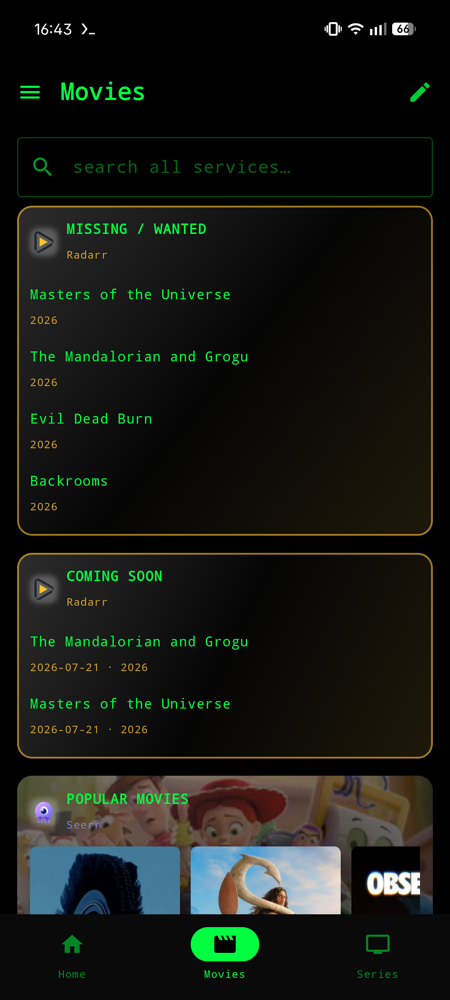

<div align="center">


<br>


**Jellyfin admin + the \*arr / download stack — one native Android app, one matrix-terminal theme.**

</div>

```console
visitor@homelab:~$ ./sanctumd --whoami

  > a single Jetpack Compose app that unifies your whole self-hosted stack.
  > add your services once — status, queues, media, requests, users, logs
  > all show up in one terminal-styled UI. every action hits each service's
  > own API directly. no backend. no account. the daemon that guards it all.
```

<div align="center">
  
  
  
  <br><br>
  
  
  
</div>

---

## ▚▚ `./features`

<details open>
<summary><b>media &amp; requests</b></summary>

```text
[jellyfin]   admin dashboard · scheduled tasks · activity log · restart
             user management (policy + per-library access, reset pw, delete)
             media browsing (continue watching, library→series→season→ep, cast)
             now playing (sessions: pause / stop / send-message) · plugins · logs
[radarr]     library · missing · cutoff · queue · history · add
[sonarr]     interactive search (formats · score · rejections) → grab
[lidarr]     manual import · per-episode monitoring · queue filter · system+health
[jellyseerr] requests · issues · discover · watchlist · per-season requests
             approve / decline · media detail w/ cast · users & stats
[prowlarr]   indexers · search · history · tasks · send-to-arr
[nzbget]     queue · history · pause / resume · edit · add-url · server details
```
</details>

<details>
<summary><b>the dashboard</b></summary>

```text
[home]    editable category tabs + a full-page Services drawer
[cards]   queues · missing · coming-soon · recently-added · poster rows
          statistics · watch leaderboard · sections · quick-buttons · calendar
[style]   per-card accent · header icon · poster size · fan-art Ken-Burns bg
          flat / solid / glass themes · universal calendar
[search]  global search across every configured service in parallel
[widgets] Glance home-screen: shortcuts · status · quick actions · agenda · stat tiles
```
</details>

<details>
<summary><b>notifications</b></summary>

```text
[live-push] subscribes directly to a topic on your ntfy server → instant local
            notifications. reuses the topic your services already webhook to.
            per-server merging · offline catch-up · masked topic in the title.
[fallback]  on-device polling worker for new media / imports / requests / health,
            baselined so there's no backlog spam.
```
</details>

<details>
<summary><b>privacy &amp; portability</b></summary>

```text
[crypto]   service credentials AES-256-GCM encrypted (Android Keystore)
[lock]     optional biometric app-lock (device-credential fallback)
[export]   password-protected (PBKDF2 → AES-GCM) portable config file
[network]  secrets excluded from cloud backup · Cloudflare Access headers
```
</details>

---

## ▚▚ `./stack`

```text
Kotlin · Jetpack Compose · Material 3 · Retrofit / OkHttp · Coil
Glance widgets · WorkManager · androidx.biometric · AES-256-GCM (Keystore)

min SDK 26 (Android 8.0)   ·   target SDK 35 (Android 15)
```

## ▚▚ `./build`

Every push triggers the **Build APK** GitHub Actions workflow — grab the
`sanctumd-debug-apk` artifact and install it:

```console
$ adb install -r sanctumd-debug.apk
```

Or build locally (no local Android SDK needed for CI contributors):

```console
$ gradle assembleDebug
  → app/build/outputs/apk/debug/app-debug.apk
```

## ▚▚ `./status`

```text
feature-complete for the current service set · in daily use
heading toward 1.0 → release-signing · full code-review · publish
```

See [CHANGELOG.md](CHANGELOG.md) for the milestone history.

---

<div align="center">

`GPL-3.0` — Sanctumd is free software. See [LICENSE](LICENSE).

</div>
